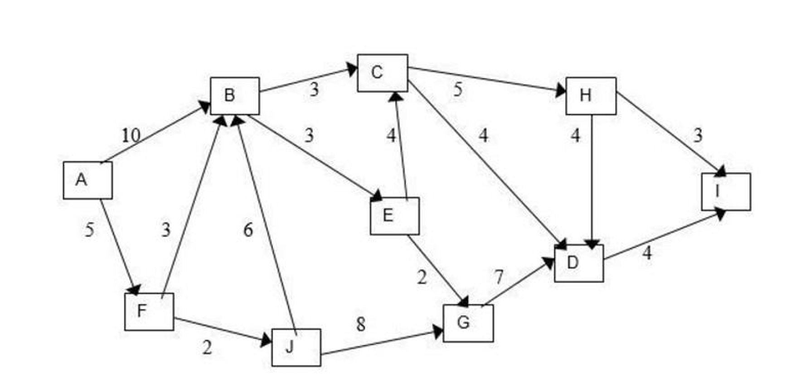
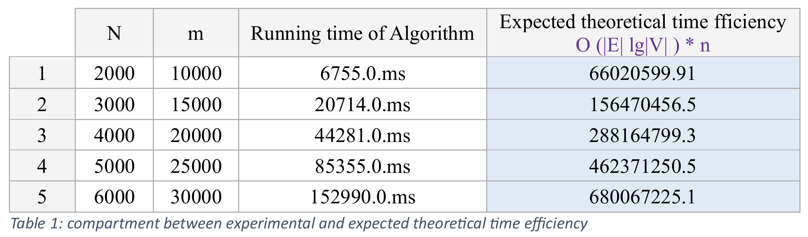
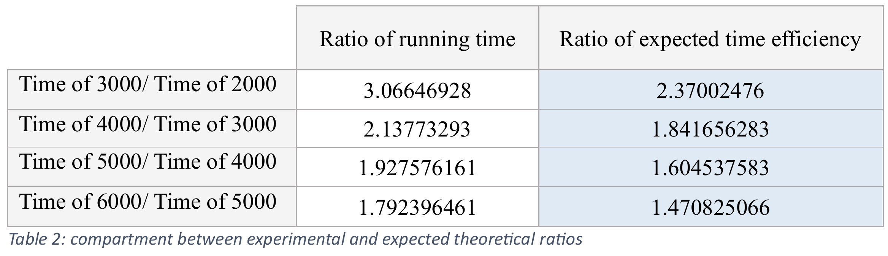

# 🛢️ Air Freight Optimization using Dijkstra's Algorithm

## 🚀 Project Overview
This project focuses on optimizing **Air Freight Transportation** using **Dijkstra's Algorithm** to solve the **All-Pairs Shortest Path** problem. The objective is to minimize travel distances and optimize delivery times for time-sensitive goods while reducing operational costs. The project was developed as part of the **CPCS 324: Algorithms and Data Structures II** course.

## 🎯 Key Features
- ✅ **Graph Representation:** Reads a directed weighted graph from a file and represents it as an adjacency list.
- ✅ **Random Graph Generation:** Generates graphs with different sizes and edge densities for performance analysis.
- ✅ **Dijkstra’s Algorithm Implementation:** Computes the shortest path between every pair of locations.
- ✅ **Performance Analysis:** Measures and compares execution times for different graph sizes.
- ✅ **Results Printing:** Displays shortest paths with their distances in a structured format.

## 🛠️ Tech Stack
- **Programming Language:** Java

## 📌 System Components
### 🗂️ Graph Representation
The project includes a **Graph Framework** consisting of:
- **Graph Class:** Represents a weighted directed graph with vertices and edges.
- **Vertex Class:** Defines graph nodes representing locations.
- **Edge Class:** Defines weighted connections between locations.

### 🔄 Dijkstra’s Algorithm Implementation
1. **Single-Source Shortest Path Computation:**
   - Implements **Dijkstra’s Algorithm** using a **priority queue (Min-Heap)**.
   - Computes the shortest paths from a starting location to all other locations.
   - Prints the shortest paths and their corresponding distances.

2. **All-Pairs Shortest Path Computation:**
   - Applies Dijkstra’s Algorithm iteratively for all locations.
   - Displays shortest paths from each location to every other location.

## 🖼️ Input Graph
The visualization below shows the graph data read from a file using the `readGraphFromFile()` method. All edges represent air routes.
<p align="center">
  
</p>


req1
<p align="center">
  
</p>

req2
<p align="center">
  
</p>

## 📊 Performance Analysis
### 🔬 Graph Generation
A function `makeGraph(n, m)` generates random directed weighted graphs for:
- `n=2000` with `m=10000`
- `n=3000` with `m=15000`
- `n=4000` with `m=20000`
- `n=5000` with `m=25000`
- `n=6000` with `m=30000`

### 📈 Performance Comparison
- **Execution Time Measurement:** Runs Dijkstra’s Algorithm on generated graphs.
  - Example of empirical runtime comparison:
<p align="center">
  
</p>

<p align="center">
  
</p>

- **Theoretical vs. Empirical Analysis:**
  - Compares observed execution times with expected theoretical time complexity.
  - Uses a ratio table to evaluate efficiency trends:
    
| n      | Execution Time (ms) | Expected Time Complexity |
|--------|---------------------|--------------------------|
| 2000   | X ms               | O(n log n)              |
| 3000   | Y ms               | O(n log n)              |
| 4000   | Z ms               | O(n log n)              |

## 🚀 Getting Started
### 🛠️ Installation & Setup
1. **Clone the repository:**
   ```sh
   git clone https://github.com/NuhaMakki/Air_Freight_Dijkstra.git
   ```
2. **Open the project in your preferred Java IDE.**
3. **Run the main program `AirFreightOptimization.java`.**

## 🔍 Usage Guide
- 📂 **Read Graph from File:** Ensure the input file follows the required structure.
- 🔢 **Generate Random Graphs:** Modify `makeGraph()` parameters for testing.
- ⏱️ **Analyze Performance:** Run the program with large datasets to evaluate efficiency.

## 🔥 Conclusion
This project applies **Dijkstra’s Algorithm** to optimize **air freight logistics** by computing the shortest delivery paths. The implementation demonstrates the practical application of **graph algorithms** in transportation networks, improving efficiency and cost-effectiveness.

## 📄 References
- "Introduction to The Design and Analysis of Algorithms" - Anany Levitin

---
📌 **Developed for CPCS 324: Algorithms and Data Structures II**

